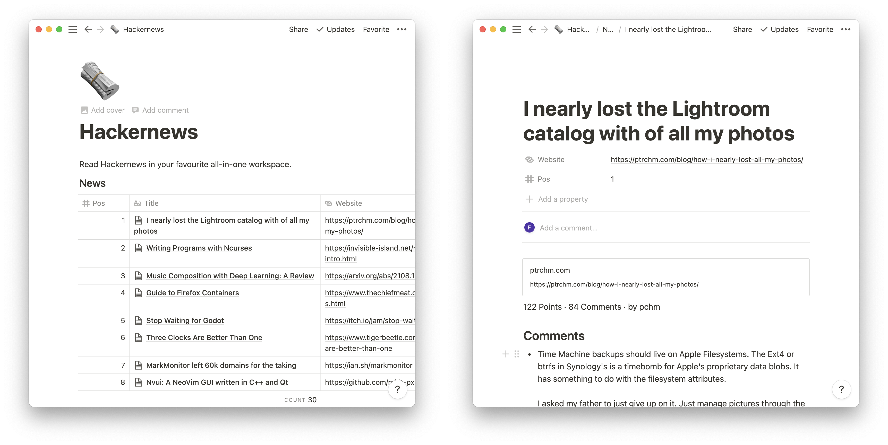

# Hackernews-Notion-Bridge

Read Hackernews in your favourite all-in-one workspace.

[Live demo](https://flofriday.notion.site/Hackernews-d67b266a89e047ff81226b36d28a7cc4)

## Why?

Well, many dislike the default HackerNews webinterface. Which is why everyone
and their dog build their own HN client. I also really enjoy using creatively
misusing tools for things they definitely weren't designed for.

So, whats a better way to jump the HN-client bandwagon, than by integrating one
of my biggest time-sinks in my favourite productivity app?

## Current Limitations

- Comments loose formatting (bold, itallic, URLs)
- Webbookmarks don't quite work (only show url but no image/description)
- Pages get replaced instead of updated

## Setup

1. [Install Python](https://www.python.org/downloads/) and create a [Notion](https://www.notion.so/) account.
2. Create a Notion integration, Notion database and share the database with the
   integration. All of which is decribed in [this Guide](https://developers.notion.com/docs/getting-started#getting-started)
3. Rename `config-example.json` to `config.json` and enter your integration
   token and database-id. [How to get the database-id](https://developers.notion.com/docs/getting-started#step-2-share-a-database-with-your-integration)
4. Add the following fields(properties) to the database:
   - Pos: Number
   - Title: Text
   - Website: URL
5. Install all dependencies with `python3 -m pip install -r requirements.txt`
6. Run the script with `python3 main.py`
